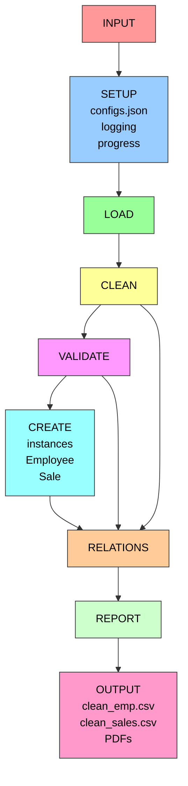

# Employee and Sales Data Processing Project

##  General description

This project provides a pipeline to read, clean, validate, and report on 
employee and sales data using Python and pandas. It is organized for maintainability 
and extensibility, with a modular structure for cleaners, validators, and reports.

### What have the project?

1. **Read** archives CSV with data d of empleoyees and sales
2. **Cleaner** the data (standardize emails, phones, names, etc.)
3. **Validate** Valid the information thw dataset
4. **Relations**  Relations and consitences between datasets
4. **Create instances** of objets Python for with validate register
5. **Generate reports** with the processing data.


# Architecture of project




## Requirements

- Python 3.8+
- pandas
- gender-guesser
- pydantic
- pytest (for testing)

---


### Ejecution

From the proyect root:

```bash
python __main__.py
```

For ejecuted tests:

```bash
pytest
```

if you want look at each module individually
```bash
pytest + copy relative path
```

---

## Centralizated configurated

### Carpeta `configs/`

the folder `configs/` centralizate all the project configuration. Allows to maintain parametres and path in the place unic, faclited changes without modifying the source codig. 

**Principal archive**: `configs/configs.json`

Contains the global configurations of project in JSON format     

**Function**:
- Define routes of input/output of data 
- Configurated the leved for logging
- Centralizated parametrs reusable in all the pipeline
- `__main__.py` load this values the init and the use for read and save archives.

---

## Relations Validator

The class  `RelationsValidator` in `src/relations/Relations.py` implemented validations between the datasets of employees and sales:

- `validate_employee_ids_in_sales()` — verific IDs of seller in sales.
- `validate_employee_names_in_sales()` — Compare name without normalization (delete prefixes/suffixes, ignore uppercase and extra spaces).
- `validate_employee_without_sales()` — Retorn DataFrame dof seller with empleados sin ventas.
- `validate_count_employees_without_sales()` — Retorn integer with the count.

---

## System centralized Logging

the proyect implement of sistem of logging 
module and centralizate for  to track ejecutions and depurated

## Proyect status

**Implemented**:

- Cleaner of data for employees and sales
- Field cleaners (email, phone)
- Validators y `RelationsValidator`
- Configuration JSON
- Orchestrator in `__main__.py
- Tests and configuration  pytest
- System of logging centralizate in all the módule

# Reports compilate  LaTeX to PDF

## Created Archives

1. report_employees_en.tex
2. report_sales_en.tex 

## Compilate request

for compilate this archives LaTex to PDF
your need have install one distribution LateX:


### Option 1: MiKTeX 
- Dowland from: https://miktex.org/download
- Instalation: Follow  the graphical installer
- after the install, `pdflatex` will be avaliable and the PATH

### Option 2: TeX Live
- Dowland from: https://tug.org/texlive/
- Follow the installer instructions

## tools used

- **pandas**: data manipulation
- **pydantic**: Schema  validation
- **rich**: ogging colorful + porgress bar
- **matplotlib**Graphics
- **jinja2**: Templates LaTeX
- **pdflatex**: Compilate to PDF
- **pytest**: Testing


